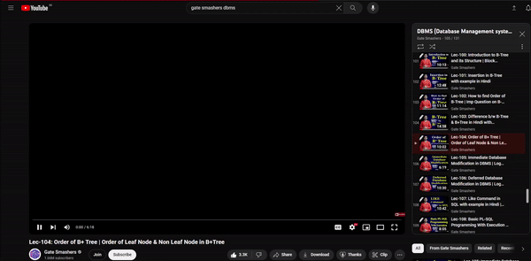

# YouTube Playlist Liker

This script automates the process of liking YouTube videos in a playlist and moving to the next one. Use it responsibly and be aware of YouTube's terms of service.

## How to Use

1. **Open the YouTube Playlist:**
   - Navigate to the YouTube playlist you want to use.
   - Open the browser's developer tools and go to the "Console" tab.

2. **Copy and Paste the Script:**
   - Copy the script below.
   - Paste the script into the browser's console and press Enter.

```javascript
// likeAndNext.js

async function likeAndNext100Times() {
  for (let i = 0; i < 100; i++) {
    // Click the like button
    const likeButton = document.querySelector('.yt-spec-button-shape-next.yt-spec-button-shape-next--tonal.yt-spec-button-shape-next--mono.yt-spec-button-shape-next--size-m.yt-spec-button-shape-next--icon-leading.yt-spec-button-shape-next--segmented-start');
    if (likeButton) {
      likeButton.click();
    } else {
      console.log('Like button not found.');
      break;
    }

    // Wait for a moment before moving to the next video
    await delayFor(2000); // Adjust the delay time to your liking

    // Go to the next video
    const nextButton = document.querySelector('.ytp-next-button.ytp-button');
    if (nextButton) {
      nextButton.click();
    } else {
      console.log('Next button not found.');
      break;
    }

    // Wait for a moment before the next iteration
    await delayFor(1000); // Adjust the delay time to your liking
  }
}

function delayFor(delay) {
  return new Promise((resolve) => {
    setTimeout(() => {
      resolve();
    }, delay);
  });
}

likeAndNext100Times();
```

3. **Watch the Magic Happen:**
   - The script will automatically click the like button and move to the next video 100 times.
   - Adjust the delay times in the script if needed.

4. **Capture the Action:**
   - Attach a GIF or screenshot of the script in action to showcase the automation.

## GIF Demo



## Important Note

This script is for educational purposes only. Be mindful of YouTube's terms of service and use automation responsibly.

Feel free to contribute or customize the script according to your needs.

Happy coding!
